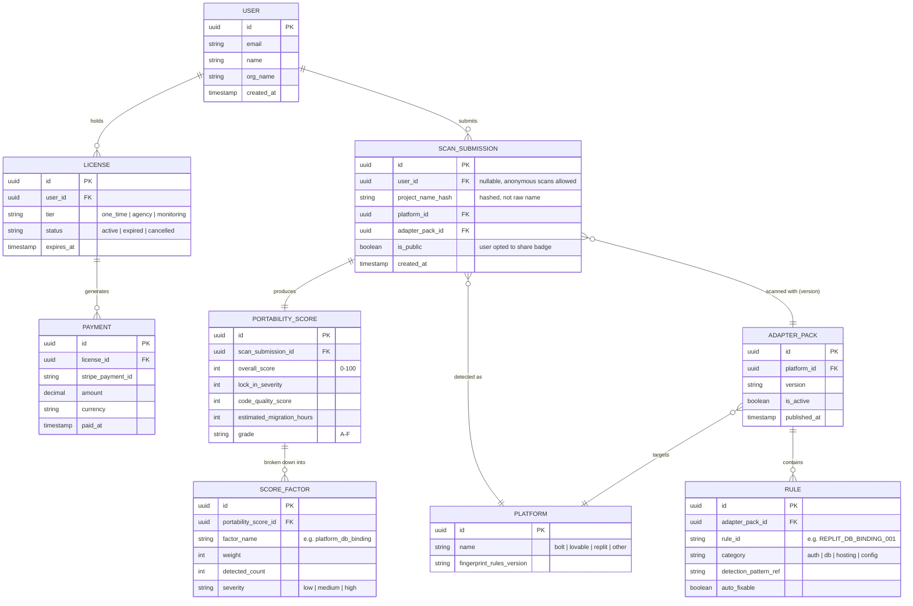

# Technical Design Document
## Platform Portability Tool — Local-First Eject Engine

**Scope:** Operates exclusively on already-exported GitHub repos or local ZIP downloads obtained through each platform's own sanctioned export feature. No direct access to Bolt/Lovable/Replit servers, sessions, or APIs at any point.

---

## 1. System Architecture

### 1.1 High-Level Design Principle

Everything that touches the user's code runs **locally, on their machine**, inside a CLI. A thin, optional cloud backend exists only for things that don't require touching source code directly: the Portability Score sharing/leaderboard, account/billing, and anonymized aggregate telemetry (opt-in). This split is deliberate — it minimizes your liability surface, avoids ever handling a user's secrets on your servers, and sidesteps most data-protection complexity.

```
┌─────────────────────────────────────────────────────────────────┐
│                         USER'S MACHINE                          │
│                                                                   │
│   GitHub repo / ZIP  ──▶  [CLI: analyse]  ──▶  Portability       │
│   (from official           │                    Report (local)   │
│    platform export)        ▼                                     │
│                        [IR Builder]                              │
│                             │                                     │
│                             ▼                                     │
│                        [Rule Engine]  ◀── Platform Adapter Packs  │
│                             │                                     │
│                             ▼                                     │
│                        [CLI: transform]                          │
│                             │                                     │
│                    ┌────────┴────────┐                            │
│                    ▼                 ▼                            │
│              [Backup Layer]   [Codemod Engine]                    │
│                                       │                            │
│                                       ▼                            │
│                              [CLI: verify]                        │
│                              (sandboxed test run,                 │
│                               Docker container)                   │
│                                       │                            │
│                                       ▼                            │
│                              [CLI: deploy]                        │
│                              (guided Vercel/Railway walkthrough)  │
└──────────────────────────────┬────────────────────────────────────┘
                                │  (optional, opt-in, no source code)
                                ▼
                 ┌─────────────────────────────────┐
                 │      CLOUD BACKEND (thin)        │
                 │  - Score submission (score only,  │
                 │    no code)                       │
                 │  - Account / license validation   │
                 │  - Billing (Stripe)                │
                 │  - Public shareable score badges   │
                 └─────────────────────────────────┘
```

### 1.2 Component Responsibilities

| Component | Responsibility | Runs where |
|---|---|---|
| CLI shell | Command routing (`analyse`, `transform`, `verify`, `deploy`), config, progress UI | Local |
| Platform Detector | Identifies source platform (Bolt/Lovable/Replit/other) from repo fingerprints | Local |
| Parser (tree-sitter) | Builds AST per file, extracts symbols/imports/calls | Local |
| IR Builder | Converts per-file ASTs into the Universal IR graph | Local |
| Rule Engine | Runs platform-specific detection rules against the IR to flag lock-in points | Local |
| Adapter Packs | Versioned rule sets + codemod scripts per platform (data, not code — see §6) | Local, pulled/cached from a public registry |
| Codemod Engine | Applies safe, reversible source transforms (via jscodeshift/ts-morph) | Local |
| Backup Layer | Snapshots repo state before any write; git-based | Local |
| Sandbox Verifier | Spins up a Docker container, installs deps, runs existing tests or generated smoke tests, before/after diff | Local (Docker required) |
| Report Generator | Produces the human-readable Portability Report + numeric score | Local |
| Deploy Assistant | Interactive walkthrough for Vercel/Railway + user's own DB | Local |
| Cloud Backend | Score badge hosting, licensing, billing, aggregate anonymized stats | Hosted (Node/Express + Postgres) |

---

## 2. Methodology

Four-phase pipeline, each independently runnable and non-destructive by default:

**Phase 1 — Analyse (read-only, always safe)**
Fingerprint the platform → parse all files → build IR → run detection rules → emit Portability Report + Score. No files are modified.

**Phase 2 — Transform (opt-in, backed up)**
Git-snapshot the repo → apply codemods flagged as auto-fixable → leave a manual-attention list for anything not safely automatable → produce a diff summary.

**Phase 3 — Verify (sandboxed)**
Build the transformed project in an isolated Docker container → run existing test suite if present, else run auto-generated smoke tests (does it build, does it boot, do key routes respond) → compare against a baseline run of the pre-transform version → pass/fail gate before Phase 4.

**Phase 4 — Deploy (guided, human-confirmed)**
Interactive CLI walkthrough: provision target (Vercel/Railway), migrate env vars, connect user's own DB instance, deploy, smoke-check the live URL. Nothing here is done without explicit user confirmation at each destructive step.

This mirrors the analyse → transform → deploy pattern already proven by the existing single-platform tool, with the Verify phase added as a hard gate — this is the phase that existing tooling in this space visibly lacks.

---

## 3. Tech Stack

| Layer | Choice | Why |
|---|---|---|
| CLI framework | Node.js + TypeScript, `commander` or `oclif` | Matches your existing stack preference; oclif gives plugin architecture for adapter packs |
| Parsing | `tree-sitter` (via `web-tree-sitter` or native bindings) | Language-agnostic AST access, fast, already validated in your earlier scoping |
| Codemods | `ts-morph` (TS/JS) + `jscodeshift` fallback | Structured, reversible AST-level transforms rather than regex string replacement |
| Dependency graph | Custom graph builder over tree-sitter output, `graphology` for graph algorithms (PageRank-style ranking) | Needed for the IR and for relevance ranking of flagged issues |
| Sandbox/verification | Docker (via `dockerode` from Node) | Isolated, reproducible test runs; avoids polluting user's environment |
| Version safety | `simple-git` (Node wrapper around git) | Automatic snapshot/branch-per-transform, easy rollback |
| Backend API | Node.js + Express | Consistent with your existing stack |
| Backend DB | PostgreSQL | Matches your standing preference; relational fit for scores/accounts/licenses |
| Billing | Stripe | Standard, matches your BillKaro experience |
| Report output | Markdown + HTML (static, locally generated) | No server dependency to view a report |
| Packaging/distribution | npm package (`npx your-tool analyse ./repo`) | Zero-install friction, matches the pattern of the existing competitor tool |
| CI for adapter packs | GitHub Actions | Adapter packs versioned and tested independently of the core CLI release cycle |

**Zero-external-API-cost note:** the core Analyse/Transform/Verify pipeline needs no LLM calls at all — it's pure static analysis and rule-based codemods. Reserve optional LLM calls (e.g., generating plain-language summaries of what changed, or doc generation) for a clearly separate, opt-in step, keeping the core product's unit economics independent of any AI API bill.

---

## 4. Data Model / ER Diagram

Scope: only the **thin cloud backend**. No source code, no secrets, no repo content ever reaches this schema — only scores, metadata, and account/billing data.



**Design notes:**
- `SCAN_SUBMISSION` stores only a **hash** of the project name and metadata — never file contents. This keeps the backend legally and operationally lightweight (no code-handling liability, minimal data-protection surface).
- `is_public` supports the shareable Portability Score badge feature without requiring the user to upload anything beyond the score itself.
- `ADAPTER_PACK` + `RULE` are versioned separately from CLI releases so you can ship new platform detection rules without forcing a CLI upgrade — this is the extensibility point that lets you add Bolt, then Replit, then others without re-architecting.

---

## 5. Working Algorithm

### 5.1 Analyse Phase (core algorithm)

```
FUNCTION analyse(repo_path):
    files = walk(repo_path, exclude=[.git, node_modules, dist])
    platform = detect_platform(files)          # fingerprint matching
                                                 # e.g. presence of specific
                                                 # config files, package.json
                                                 # markers, import patterns

    adapter_pack = load_adapter_pack(platform)  # cached locally, checked
                                                 # for updates against registry

    ast_map = {}
    FOR file IN files:
        ast_map[file] = tree_sitter_parse(file)

    ir = build_ir(ast_map)
    # ir contains: symbol table, call graph, import graph,
    # data-layer bindings, config/env references

    findings = []
    FOR rule IN adapter_pack.rules:
        matches = rule.detect(ir)               # pattern match against IR,
                                                  # not raw text — resilient
                                                  # to formatting differences
        findings.extend(matches)

    ranked_findings = rank_by_pagerank(findings, ir.call_graph)
    # surfaces findings on frequently-called/central code paths first

    quality_metrics = compute_quality(ir)
    # duplication %, doc coverage, avg file size, cyclomatic complexity

    score = compute_portability_score(findings, quality_metrics)
    report = generate_report(findings, quality_metrics, score)

    RETURN report, score
```

### 5.2 Transform Phase

```
FUNCTION transform(repo_path, findings):
    git_snapshot = create_backup_branch(repo_path)

    auto_fixable = [f for f in findings if f.auto_fixable]
    manual_review = [f for f in findings if NOT f.auto_fixable]

    FOR finding IN auto_fixable:
        codemod = load_codemod(finding.rule_id)
        ast = ts_morph.load(finding.file)
        codemod.apply(ast, finding.location)     # structured AST edit,
                                                    # not string replace
        ast.save()

    diff_summary = git_diff(git_snapshot, repo_path)

    RETURN diff_summary, manual_review
```

### 5.3 Verify Phase

```
FUNCTION verify(repo_path, pre_transform_snapshot):
    container_before = docker_build(pre_transform_snapshot)
    container_after   = docker_build(repo_path)

    result_before = run_checks(container_before)
    result_after  = run_checks(container_after)

    # run_checks does, in order:
    #  1. install dependencies
    #  2. build/compile
    #  3. run existing test suite if present
    #  4. if no tests: boot the app, hit key routes
    #     (health check, root route, any detected API routes),
    #     confirm 2xx/3xx responses

    diff = compare(result_before, result_after)

    IF diff.regressions > 0:
        RETURN FAIL, diff
    ELSE:
        RETURN PASS, diff
```

### 5.4 Portability Score Computation

```
FUNCTION compute_portability_score(findings, quality_metrics):
    lock_in_penalty = SUM(
        finding.severity_weight FOR finding IN findings
    )
    quality_penalty = (
        (100 - quality_metrics.doc_coverage) * 0.2 +
        quality_metrics.duplication_pct * 0.3 +
        quality_metrics.avg_complexity_over_threshold * 0.2
    )

    raw_score = 100 - lock_in_penalty - quality_penalty
    score = clamp(raw_score, 0, 100)
    grade = score_to_grade(score)   # A-F banding

    RETURN score, grade
```

---

## 6. Adapter Pack Design (the extensibility mechanism)

Each platform gets a self-contained, versioned pack — this is how you add Replit or Bolt support without touching the core engine:

```
adapter-packs/
  replit/
    manifest.json          # platform fingerprints, version
    rules/
      db-binding.json       # detection pattern + severity + auto_fixable flag
      auth-wrapper.json
      hosting-config.json
    codemods/
      db-binding.codemod.ts
      auth-wrapper.codemod.ts
    tests/
      fixtures/             # real (sanitized) sample projects for regression testing
```

Rules are declarative where possible (pattern + severity + fixable flag as JSON), with codemods as the only actual executable code per rule — this keeps the bulk of platform-specific knowledge auditable and reviewable without deep engine changes, and is what lets the system scale to N platforms over time.

---

## 7. What's Needed to Complete v1 Development

### 7.1 Build checklist

1. **Platform fingerprinting** — collect real exported repos from Bolt, Replit, and Lovable; identify reliable, stable markers (config file signatures, package.json patterns, folder conventions) to auto-detect source platform.
2. **IR builder** — tree-sitter integration for JS/TS (the common denominator across all three platforms per the earlier research); symbol table + call graph + data-binding extraction.
3. **First adapter pack (Replit or Bolt)** — start with 5–10 highest-impact rules (DB binding, auth wrapper, hosting config, env var patterns) rather than exhaustive coverage.
4. **Codemod library** — implement auto-fixable transforms for the rules above using ts-morph; anything not safely automatable goes to the manual-review list rather than being force-fixed.
5. **Backup/rollback layer** — git-based snapshotting before any write; a `--rollback` command to restore.
6. **Sandbox verifier** — Docker-based before/after test harness; this is the highest-risk, highest-trust component and deserves the most engineering time relative to its apparent simplicity.
7. **Report generator** — Markdown/HTML output, plus the numeric Portability Score.
8. **CLI packaging** — `npx`-installable, clear command structure (`analyse`, `transform`, `verify`, `deploy`, `rollback`).
9. **Deploy assistant** — Vercel/Railway CLI integration, guided env var migration.
10. **Legal scaffolding** — as-is/no-warranty terms, mandatory backup confirmation before any destructive action, clear liability disclaimer surfaced in the CLI itself before first transform.

### 7.2 Validation checklist (before charging anyone)

- Run against 3–5 real exported projects per platform; confirm Verify phase catches any regressions before a human does.
- Confirm the tool never makes an outbound call to the source platform's own servers at any point (audit network calls in the CLI as a hard requirement, not an assumption).
- Confirm secrets/env values are never logged, written to any file outside the user's own repo, or transmitted anywhere.

### 7.3 Deferred to post-v1 (per the phased PRD)

- Cloud backend (score sharing, billing) — only needed once you're ready to charge or want the free-score funnel live.
- Drift monitoring (continuous scans) — needs the core Analyse engine proven stable first.
- Additional platform adapter packs — added incrementally once the first one is validated end-to-end.

---

## 8. Safety Principles (non-negotiable, carried from legal review)

- Every write operation requires a prior git snapshot — no exceptions, no flag to skip.
- Verify phase is a hard gate before Deploy is offered — a failed verify blocks the deploy step in the CLI, not just a warning.
- No network call to Bolt/Lovable/Replit infrastructure, ever, from any part of the tool.
- No telemetry containing source code, file contents, or secrets — only anonymized, aggregate rule-trigger counts, opt-in only.
